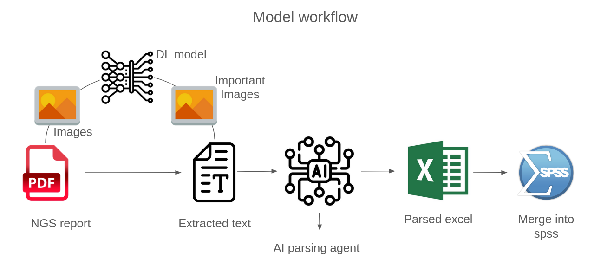
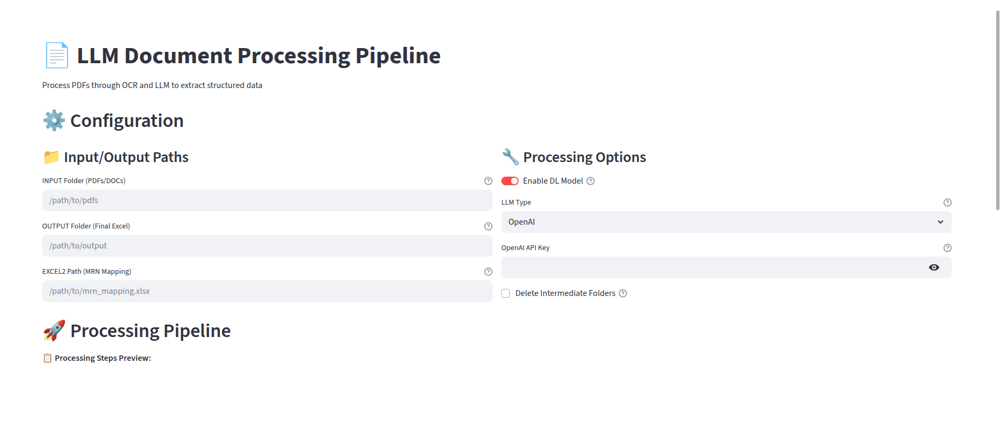
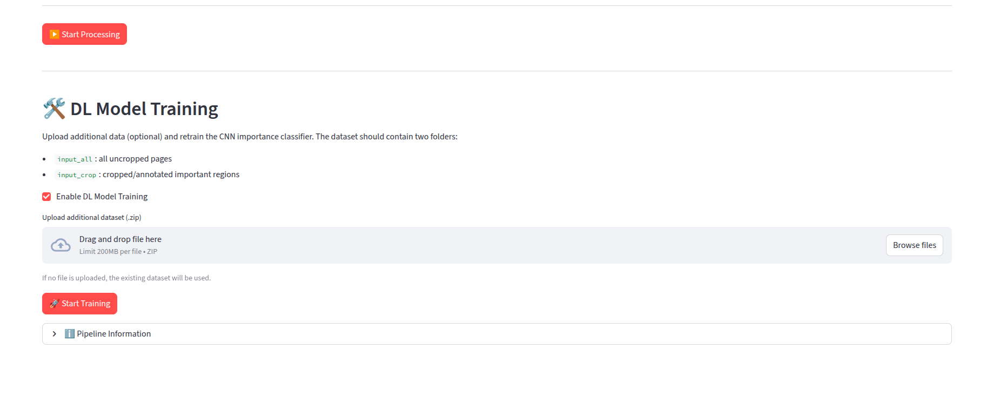
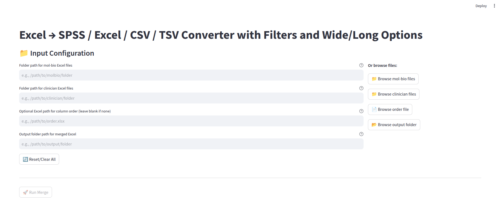
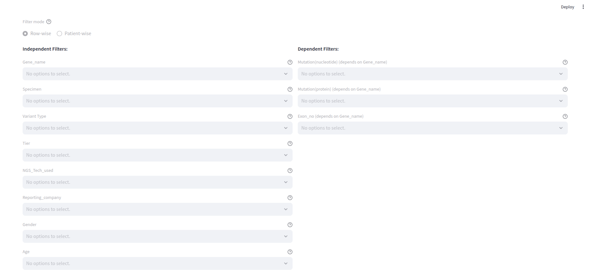
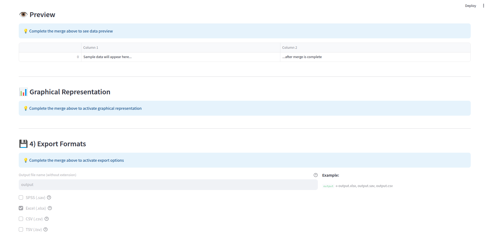

LLM Document Processing Toolkit
================================



End-to-end pipeline that converts raw NGS PDF reports into structured spreadsheets. Wraps OCR, LLM parsing, and optional deep-learning page filtering inside a Streamlit app, with a companion interface for merging clinical data and generating exports.

---

Features
--------

- **PDF ➝ Structured Data**: Converts PDFs/DOCs to images, runs OCR, applies LLM parsing, exports Excel/SPSS-ready files.
- **DL Page Filter (Optional)**: CNN model filters “important” pages before OCR.
- **LLM Choices**: OpenAI (API key), Deepseek, or Llama via Ollama.
- **Built-in Model Retraining**: Upload new labeled datasets and retrain the CNN directly from the UI.
- **Clinical Merge App**: Combine molecular outputs with clinician spreadsheets, filter, chart, and export.

---

Setup
-----
Make sure your pytorch CUDA version matches with your GPU's CUDA version- change torch installation command accordingly
```bash
#Install pytorch according to GPU driver and CUDA version
pip3 install torch torchvision torchaudio --index-url https://download.pytorch.org/whl/cu128
# Base environment (CPU-friendly)
pip install -r requirements2.txt

# GPU environment (Torch + Doctr + CUDA extras)
pip install -r requirements_gpu.txt
```

> When using OpenAI, export `OPENAI_API_KEY` or paste it into the Streamlit form.

---

Run the Pipeline App
--------------------

```bash
streamlit run llm_app/llm_app.py
```

The configuration screen looks like this:



1. **Inputs**
   - `INPUT Folder`: directory with PDFs/DOCs to process.
   - `OUTPUT Folder`: destination for compiled Excel/CSV/SPSS.
   - `EXCEL2 Path`: mapping workbook containing `filename`, `MRN`, `Patient_name`, `Cases_Discussed_Not_discussed`.
2. **Options**
   - Toggle **Enable DL Model** to run the CNN page filter.
   - Select **LLM Type** (OpenAI / Deepseek / Llama).
   - Provide **OpenAI API Key** if required.
   - Toggle **Delete Intermediate Folders** to clean up temp directories.
3. **Execution**
   - Click **Start Processing**; the visual stepper updates as each stage completes:


Stages:

1. GPU check  
2. PDF ➝ images  
3. (Optional) DL sorting  
4. OCR (Doctr)  
5. Text collation  
6. LLM extraction  
7. Excel/SPSS conversion  

All compiled spreadsheets are saved as `{folder_name}_compiled.xlsx` beneath your chosen output directory.

---

Retrain the CNN Page Filter
---------------------------

Within `llm_app.py`, open the **DL Model Training** expander:



### Dataset Layout

Place datasets under `codes_model/dataset` using:

```
codes_model/dataset/
└── {company_name}/
    ├── pdfs/            # optional reference PDFs
    ├── input_all/       # full-page images (one subdir per report)
    └── input_crop/      # same structure, cropped “important” views
```

To build `input_all`:
1. Process ≈50 PDFs with `python llm_app/pdf_to_image.py`.

To build `input_crop`:
1. Copy `input_all`.
2. For each page, crop key sections and save as `pageNNN_imp_1.jpg`, `pageNNN_imp_2.jpg`, etc.
3. Leave non-important pages unchanged.

### Upload & Train

- Zip the `{company_name}` folder and upload it (default limit 200 MB; raise via `st.set_option('server.maxUploadSize', 1024)` for ~1 GB).
- Or manually drop the folder into `codes_model/dataset`.
- Toggle **Enable DL Model Training**, provide the dataset path, then click **Start Training**.

The app workflow:

1. Validate the dataset structure.  
2. Run `codes_model/data_proc.py` to create train/val/test splits.  
3. Launch `codes_model/train.py` (CNN architecture, epochs/batch-size set in code).  
4. Plot training/validation loss & accuracy.  
5. Display final metrics and save `best.pt` to `codes_model/runs/exp_cnn_512x360/`.  

If GPU is unavailable, the UI aborts the run and reports the issue.

---

Clinical Merge & Analytics App
------------------------------

```bash
streamlit run app/graphapp.py
```



Workflow:

1. Provide molecular and clinician Excel folders plus optional column-order workbook.  
2. Merge and preview the combined dataset.  
3. Use inline filters to refine the view:  



4. Generate charts and export to multiple formats:  



Exports include Excel, CSV, TSV, and SPSS-ready files.

---

Additional Notes
----------------

- DL inference temp directories (for example `_temp_predictions`) are cleaned automatically.
- Include the `app/` image assets when publishing so the README renders correctly.
- Adjust the Streamlit upload limit if you plan to retrain with larger datasets.

---

**Happy parsing!**

